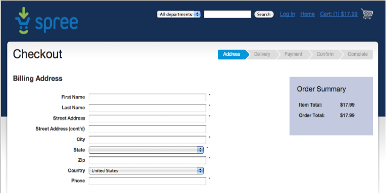
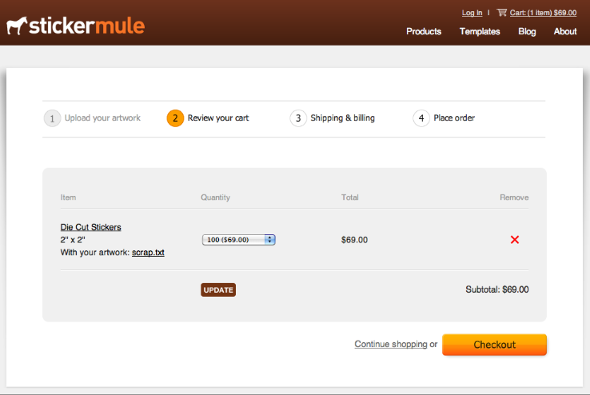

!SLIDE bullets incremental

# So What's The Big Deal? #

* Engines can be shipped as gems
* That means easy versioning and configuration via bundler
* Behave like traditional Rails application

!SLIDE bullets incremental

# Rails-like Behavior #

* Models, Views and Controllers
* Rake tasks
* Generators
* Routes
* Locales

!SLIDE bullets incremental

# Mountable Apps #

* Yehuda Katz spoke about this at Railsconf in 2009
* Would be cool to mount multiple rack apps
* The goal was to achieve this in Rails 3.0
* They delivered on most of it
* The rest will ship with Rails 3.1 (More later)

!SLIDE center

# That's Interesting ... #

!SLIDE center

# But What Else? #

!SLIDE bullets incremental

# This Opens a Whole New World of Possibilities for Rails-based Frameworks #

* 

!SLIDE bullets incremental

# Standard Rails Application #

* Lets add Spree
* Its easy because its a gem and we have Bundler!

!SLIDE

    @@@ruby
    #Gemfile
    gem 'spree', '0.30.0'

!SLIDE

    $ bundle install

!SLIDE bullets incremental

## Default Spree Checkout Looks Like This ##

* 

!SLIDE bullets incremental

## We Need it To Look Like This ##

* 

!SLIDE center

# No Problem! #

!SLIDE center

# Overrides to the Rescue! #
